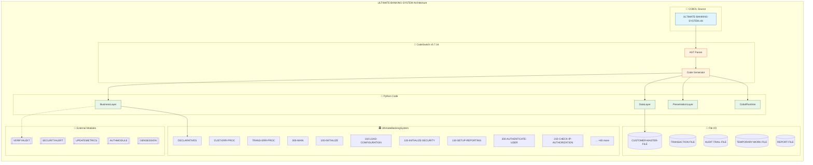

# Architecture Diagram

```mermaid
graph TD
    subgraph "ULTIMATE-BANKING-SYSTEM Architecture"
        direction TB

        subgraph Source["📄 COBOL Source"]
            COBOL["ULTIMATE-BANKING-SYSTEM.cbl"]
        end

        subgraph Transpiler["🔄 CodeSwitch v5.7.34"]
            AST["AST Parser"]
            GEN["Code Generator"]
        end

        subgraph Generated["🐍 Python Code"]
            DATA["DataLayer"]
            BIZ["BusinessLayer"]
            PRES["PresentationLayer"]
            RT["CobolRuntime"]
        end

        subgraph MainClass["🏛️ UltimateBankingSystem"]
            declaratives["DECLARATIVES"]
            cust_err_proc["CUST-ERR-PROC"]
            trans_err_proc["TRANS-ERR-PROC"]
            p_000_main["000-MAIN"]
            p_100_initialize["100-INITIALIZE"]
            p_110_load_configuration["110-LOAD-CONFIGURATION"]
            p_120_initialize_security["120-INITIALIZE-SECURITY"]
            p_130_setup_reporting["130-SETUP-REPORTING"]
            p_200_authenticate_user["200-AUTHENTICATE-USER"]
            p_210_check_ip_authorization["210-CHECK-IP-AUTHORIZATION"]
            MORE["... +65 more"]
        end

        subgraph Files["📁 File I/O"]
            customer_master_file[("CUSTOMER-MASTER-FILE")]
            transaction_file[("TRANSACTION-FILE")]
            audit_trail_file[("AUDIT-TRAIL-FILE")]
            temporary_work_file[("TEMPORARY-WORK-FILE")]
            report_file[("REPORT-FILE")]
        end

        subgraph External["🔌 External Modules"]
            verifyaudit[[VERIFYAUDIT]]
            securityalert[[SECURITYALERT]]
            updatemetrics[[UPDATEMETRICS]]
            authmodule[[AUTHMODULE]]
            gensession[[GENSESSION]]
        end

    end

    %% Flow connections
    COBOL --> AST
    AST --> GEN
    GEN --> DATA
    GEN --> BIZ
    GEN --> PRES
    GEN --> RT
    BIZ --> declaratives
    DATA --> customer_master_file
    BIZ -.-> verifyaudit

    %% Styling
    classDef source fill:#e1f5fe,stroke:#01579b
    classDef transpiler fill:#fff3e0,stroke:#e65100
    classDef generated fill:#e8f5e9,stroke:#2e7d32
    classDef external fill:#fce4ec,stroke:#c2185b
    class COBOL source
    class AST,GEN transpiler
    class DATA,BIZ,PRES,RT generated
```