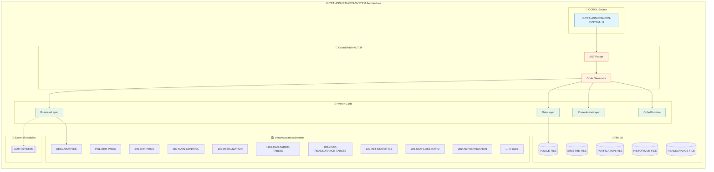

```mermaid
graph TD
    subgraph "ULTRA-ASSURANCES-SYSTEM Architecture"
        direction TB

        subgraph Source["📄 COBOL Source"]
            COBOL["ULTRA-ASSURANCES-SYSTEM.cbl"]
        end

        subgraph Transpiler["🔄 CodeSwitch v5.7.34"]
            AST["AST Parser"]
            GEN["Code Generator"]
        end

        subgraph Generated["🐍 Python Code"]
            DATA["DataLayer"]
            BIZ["BusinessLayer"]
            PRES["PresentationLayer"]
            RT["CobolRuntime"]
        end

        subgraph MainClass["🏛️ UltraAssurancesSystem"]
            declaratives["DECLARATIVES"]
            pol_err_proc["POL-ERR-PROC"]
            sin_err_proc["SIN-ERR-PROC"]
            p_000_main_control["000-MAIN-CONTROL"]
            p_100_initialization["100-INITIALIZATION"]
            p_110_load_tariff_tables["110-LOAD-TARIFF-TABLES"]
            p_120_load_reassurance_tables["120-LOAD-REASSURANCE-TABLES"]
            p_130_init_statistics["130-INIT-STATISTICS"]
            stat_loss_ratio["WS-STAT-LOSS-RATIO"]
            p_200_authentication["200-AUTHENTICATION"]
            MORE["... +7 more"]
        end

        subgraph Files["📁 File I/O"]
            police_file[("POLICE-FILE")]
            sinistre_file[("SINISTRE-FILE")]
            tarification_file[("TARIFICATION-FILE")]
            historique_file[("HISTORIQUE-FILE")]
            reassurance_file[("REASSURANCE-FILE")]
        end

        subgraph External["🔌 External Modules"]
            auth_system[[AUTH-SYSTEM]]
        end

    end

    %% Flow connections
    COBOL --> AST
    AST --> GEN
    GEN --> DATA
    GEN --> BIZ
    GEN --> PRES
    GEN --> RT
    BIZ --> declaratives
    DATA --> police_file
    BIZ -.-> auth_system

    %% Styling
    classDef source fill:#e1f5fe,stroke:#01579b
    classDef transpiler fill:#fff3e0,stroke:#e65100
    classDef generated fill:#e8f5e9,stroke:#2e7d32
    classDef external fill:#fce4ec,stroke:#c2185b
    class COBOL source
    class AST,GEN transpiler
    class DATA,BIZ,PRES,RT generated
```